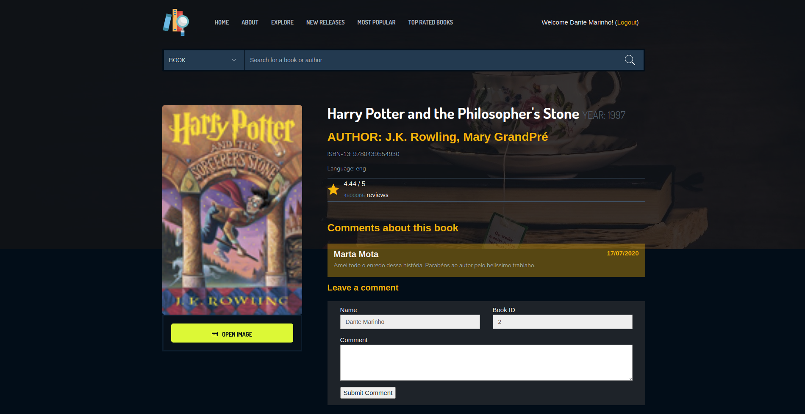

# Web Semântica - Trabalho 1 (Época de Recurso)

Book catalog application developed in Python3 and using SPARQL and GraphDB to deal with RDF graph data.



## Pre-requisits before running the project

- GraphDB
    - Create a repository named "booksguru"
    - import books.csv using Tabular(OntoRefine)
    - on isbn13 column make Edit cells >> Transform and put the value: value.replace(".", "").replace("e+12", "0")
- Python3.6
    - sudo apt-get install python3-pip
    - python3 -m pip install django
    - pip3 install setuptools
    - pip3 install s4api
    - pip3 install django-crispy-forms

## Running this project

It's needed execute commands to prepare the BD:

```
python3 manage.py makemigrations
python3 manage.py migrate
```

Inside the root folder run the command:

```
python3 manage.py runserver
```

Now, you can access one of these links:
- http://localhost:8000
- http://localhost:8000/booksguru/

## Useful Links and References:

- Questions tagged [graphdb]  
  https://stackoverflow.com/questions/tagged/graphdb
- Importar dados CSV e converter para RDF | Loading Data Using OntoRefine  
  http://graphdb.ontotext.com/documentation/standard/loading-data-using-ontorefine.html
- GraphDB 8 OntoRefine tool  
  https://www.youtube.com/watch?v=YFb7hnZNLdQ
- Webinar GraphDB 9.1 Knowledge graphs with data provenance  
  https://www.youtube.com/watch?v=Vu1T0ozz6Og&list=PLSEiuYkICmDlpZSpWSsPjNAQhKh-raIiu
- Built-in template tags and filters  
  https://docs.djangoproject.com/en/3.0/ref/templates/builtins/
- Django Authentication Video Tutorial  
  https://github.com/sibtc/django-auth-tutorial-example
- Django - always getting False in form.is_valid()  
  https://groups.google.com/forum/#!topic/django-users/z5EjU2-RgtU
- Installing django-crispy-forms  
  https://django-crispy-forms.readthedocs.io/en/latest/install.html
- s4api 1.1.0  
  https://pypi.org/project/s4api/

## New Implementations for "Recurso" Epoc

- Added route do "/" for better user experience
- Improved the graphical style of the website
- Working with models, forms, views, urls and templates
- Using Django Admin by registering models (admin.sites.register (ModelName))
- Created system to login, logout and register users
- Welcome message to the user
- Add comment for a book, only for logged in users
- Use of the SQlite3 database, in addition to GraphDB
- When load a book details page, the system get all comments tho actual book, from BD

Default user passwords: userpass2020
